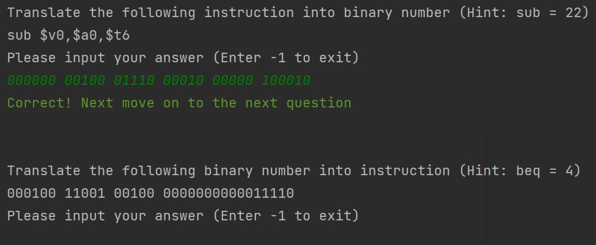

# MIPSQuizGenerator
Generate random MIPS instructions for practicing

# Motivation
I studied Computer Organization in 2017 that have plenty of questions asking me to give binary representation of a MIPS instruction (or vice versa). 
I wrote this little program for me to pratice that so I can get used to it 🤣.

